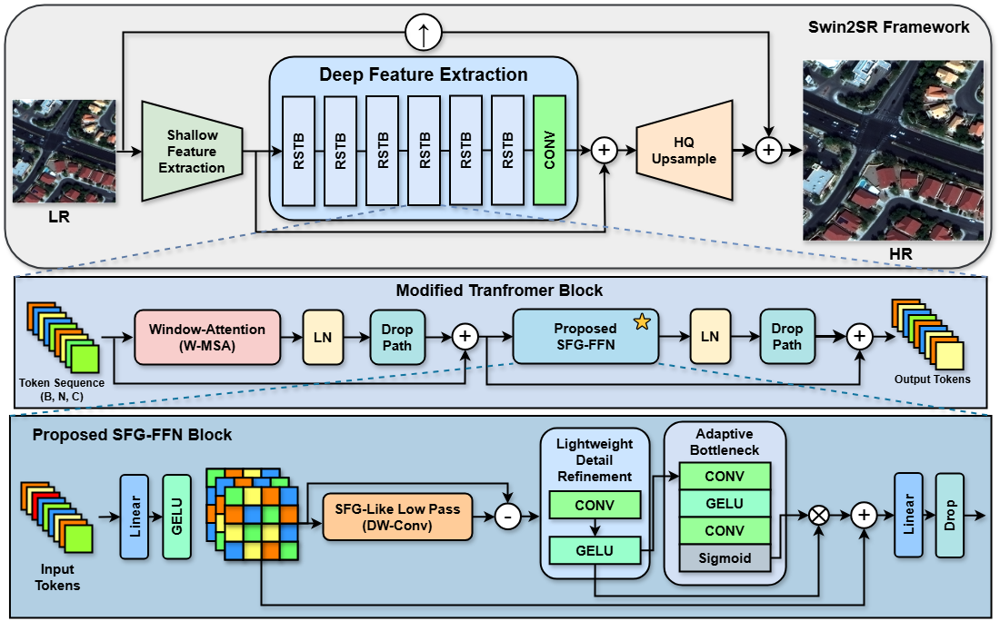
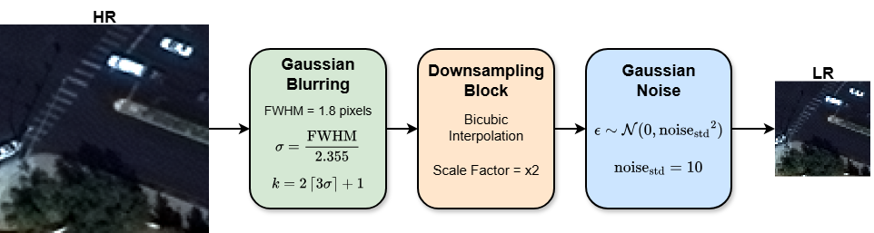
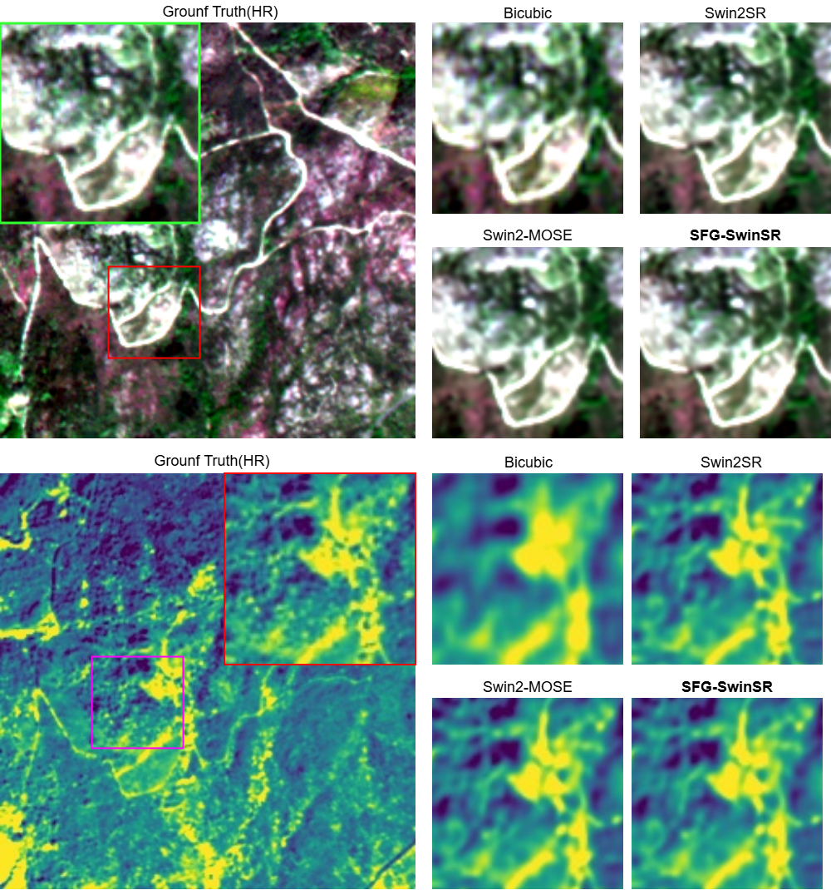

<p align="center">
  
</p>

<h1 align="center">
  SFG-SwinSR: Spatial-Frequency Gated Swin Transformer for Remote Sensing Single-Image Super-Resolution
</h1>

<p align="center">
  Md Aminur Hossain,
  Parekh Valkesh,
  Ayush V. Patel,
  Yogesh Jethani,
  Sanjay K. Singh,
  Biplab Banerjee
</p>

<p align="center">
  <b>
    Space Applications Centre, ISRO, Ahmedabad, India<br>
    Indian Institute of Technology Bombay, India<br>
    New L J Institute of Engineering and Technology, Ahmedabad, India<br>
    Pandit Deendayal Energy University, Gandhinagar, India<br>
    GLS University, Ahmedabad, India
  </b>
</p>

<p align="center">
  <a href="https://arxiv.org/abs/xxxx.xxxxx"></a>
  <a href="https://huggingface.co/datasets/your-org/your-dataset"></a>
  <a href="https://huggingface.co/your-org/your-model"></a>
</p>

## Overview

SFG-SwinSR is a Swin2SR-based super-resolution model for remote sensing imagery. It replaces the standard transformer feed-forward network with a **Spatial-Frequency Gated FFN (SFG-FFN)** that separates low-frequency structural content from high-frequency residual detail and reinjects useful details through lightweight adaptive gating.

This repository contains:

- the released model implementation in `SFGSwinSR.py`
- SpaceNet baseline Swin2SR training and evaluation scripts under `spacenet/`
- training and evaluation scripts under `sen2venμs/`
- ablation utilities under `ablations/`
- release-safe README assets under `docs/images/`
- placeholders for paper and Hugging Face resource links in the header badges

## Architecture

<p align="center">
  
</p>

The model keeps the Swin2SR attention backbone and modifies the FFN inside each transformer block. The SFG-FFN estimates low-frequency content with depthwise blur, extracts high-frequency residuals, refines them spatially, and applies adaptive gating before projection back to the token space.

## SpaceNet Pair Generation

<p align="center">
  
</p>

For SpaceNet, low-resolution inputs are synthetically generated from high-resolution imagery using the paper's degradation pipeline: blur, bicubic downsampling, and noise injection.

## Headline Results

The following metrics are taken from the paper results currently included in the LaTeX sources under `SingleSR/`.

| Dataset | Model | Params (M) | PSNR (dB) | SSIM | MAE |
|---|---|---:|---:|---:|---:|
| SpaceNet | Swin2SR | 12.09 | 43.56 | 0.9780 | 0.0039 |
| SpaceNet | Swin2-MoSE | 11.45 | 44.61 | 0.9816 | 0.0034 |
| SpaceNet | **SFG-SwinSR** | **13.73** | **45.19** | **0.9852** | **0.0031** |
| SEN2VENuS x2 | Swin2SR | 12.09 | 48.43 | 0.9932 | 0.0029 |
| SEN2VENuS x2 | Swin2-MoSE | 11.45 | 48.97 | 0.9937 | 0.0026 |
| SEN2VENuS x2 | **SFG-SwinSR** | **13.73** | **49.35** | **0.9949** | **0.0025** |
| SEN2VENuS x4 | Swin2SR | 12.09 | 44.12 | 0.9792 | 0.0049 |
| SEN2VENuS x4 | Swin2-MoSE | 11.49 | 45.12 | 0.9806 | 0.0045 |
| SEN2VENuS x4 | **SFG-SwinSR** | **13.73** | **45.52** | **0.9837** | **0.0042** |

Key takeaways reported in the paper:

- `+1.63 dB` PSNR over Swin2SR on SpaceNet
- `+0.92 dB` PSNR over Swin2SR on SEN2VENuS x2
- `+1.40 dB` PSNR over Swin2SR on SEN2VENuS x4

## Qualitative Results

### SpaceNet

<p align="center">
  
</p>

Visual comparison on SpaceNet. From left to right: Ground Truth, Bicubic, Swin2SR, Swin2-MoSE, and SFG-SwinSR.

### SEN2VENuS

<p align="center">
  
</p>

Visual comparison on SEN2VENuS. The paper reports improved boundary recovery, finer structural detail, and lower reconstruction error under the evaluated settings.

## Repository Layout

```text
SFG-SwinSR/
|-- SFGSwinSR.py
|-- README.md
|-- .gitignore
|-- docs/
|   `-- images/
|-- spacenet/
|   |-- train.py
|   |-- evaluation.py
|   |-- singleSR_model_train.py
|   |-- config.yml
|   |-- config.json
|   `-- info.txt
|-- sen2venμs/
|   |-- train.py
|   |-- evaluation.py
|   |-- config.yml
|   `-- info.txt
`-- ablations/
    |-- ablation_runner.py
    `-- info.txt
```

## Datasets and Configuration

The current repository is organized around experiments on:

- SpaceNet / WorldView-2
- SEN2VENuS

The `data/` directory in this repository contains sample files only for smoke testing and command-line verification. It is not the full training or evaluation dataset release.

Dataset paths, scale settings, crop sizes, and normalization statistics are defined in:

- `spacenet/config.yml`
- `spacenet/config.json`
- `sen2venμs/config.yml`

Standalone local path constants are also kept as placeholders in:

- `spacenet/singleSR_model_train.py`

Update those paths and values for your local environment before running experiments.

## Main Files

### `SFGSwinSR.py`

Contains:

- `SpatialFrequencyGatedFFN`
- the modified Swin2SR layer forward path
- the `MAGSwin2SR` wrapper used by the project

### `spacenet/train.py`

Configuration-driven training entrypoint for the baseline `Swin2SR` model on SpaceNet.

### `spacenet/evaluation.py`

Evaluation script for metrics and super-resolved image export.

### `spacenet/singleSR_model_train.py`

Training script for the proposed `MAGSwin2SR` / `SFG-SwinSR` model with directly embedded local constants.

### `ablations/ablation_runner.py`

Runner for backbone and loss ablation experiments.

## Training and Evaluation

### SpaceNet

Train baseline Swin2SR:

```bash
python spacenet/train.py --config spacenet/config.yml
```

Evaluate:

```bash
python spacenet/evaluation.py \
  --model-type mag \
  --checkpoint path/to/your/checkpoint.pt \
  --lr-dir path/to/your/lr_dir \
  --hr-dir path/to/your/hr_dir \
  --output-dir path/to/your/output_dir
```

Train proposed SFG-SwinSR / MAGSwin2SR:

```bash
python spacenet/singleSR_model_train.py
```

### SEN2VENuS

Train:

```bash
python "sen2venμs/train.py" --config "sen2venμs/config.yml"
```

Evaluate:

```bash
python "sen2venμs/evaluation.py" \
  --model-type mag \
  --checkpoint path/to/your/checkpoint.pt \
  --lr-dir path/to/your/lr_dir \
  --hr-dir path/to/your/hr_dir \
  --output-dir path/to/your/output_dir
```

## Environment

The scripts depend mainly on:

- Python 3.8+
- PyTorch
- Transformers
- Rasterio
- NumPy
- Kornia
- scikit-image
- PyYAML
- tqdm

Install these packages before running the training or evaluation scripts:

```bash
pip install -r requirements.txt
```

## Release Notes

- The figures shown in this README are copied into `docs/images/` so the repository can render them without tracking the full paper workspace.
- Dataset locations and output directories remain local configuration items and should be updated before use.

## Citation

If you use this repository, cite the corresponding paper:

```bibtex
@article{hossain2026sfgswinsr,
  title={Spatial-Frequency Gated Swin Transformer for Remote Sensing Single-Image Super-Resolution},
  author={Hossain, Md Aminur and Valkesh, Parekh and Patel, Ayush V. and Jethani, Yogesh and Singh, Sanjay K. and Banerjee, Biplab},
  year={2026}
}
```
